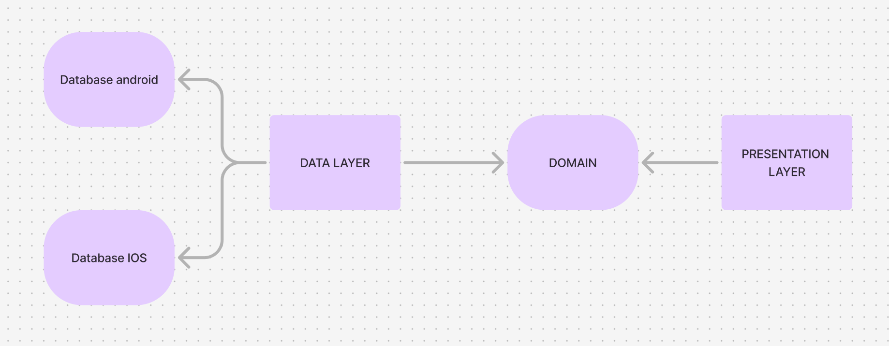
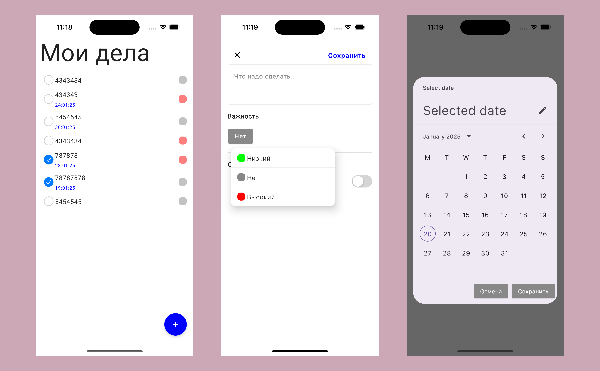
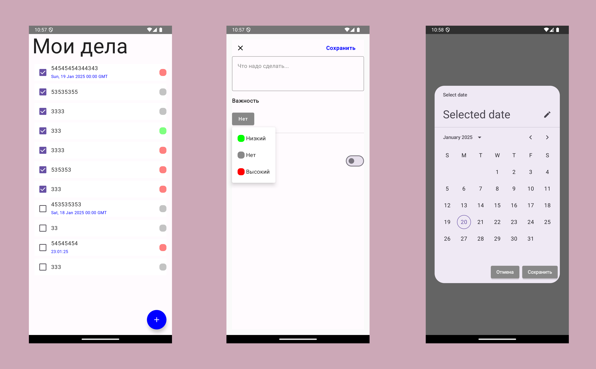

# Kotlin Multiplatform "ListCase"
### Stack:
* [Kotlin](https://kotlinlang.org/docs/multiplatform.html)
* [Compose](https://github.com/JetBrains/compose-multiplatform)
* [Precompose](https://github.com/Tlaster/PreCompose)
* [Cupertino-adaptive](https://github.com/alexzhirkevich/compose-cupertino)
* [Kotlinx%20datetime](https://github.com/Kotlin/kotlinx-datetime)
* [SqlDelight](https://sqldelight.github.io/sqldelight/2.0.2/multiplatform_sqlite/)
* [Koin](https://insert-koin.io/docs/quickstart/kmp/)
* [ViewModel](https://github.com/hoc081098/kmp-viewmodel)

### Architecture
* MVI + Clean Architecture

### Screens
#### IOS

#### Android

